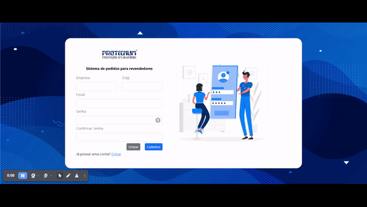

# componentSignUpProtecnum
Componente do sistema de gestão de pedidos da empresa Protecnum

  

##Link
 Projeto online:[Acesse aqui](https://component-sign-up-protecnum.vercel.app/)

## Description
Componente interativo para cadastro de usuário desenvolvido com a tecnologia [React](https://react.dev/).Para ser utilizado no sistema de gestão de pedidos da empresa Protecnum. Uma interface simples com um layout agradável.

## Packages
   * "@testing-library/jest-dom": "^5.17.0",
   * "@testing-library/react": "^13.4.0",
   * "@testing-library/user-event": "^13.5.0",
   * "bootstrap": "^5.3.0",
   * "formik": "^2.4.2",
   * "react": "^18.2.0",
   * "react-bootstrap": "^2.8.0",
   * "react-dom": "^18.2.0",
   * "react-icons": "^4.10.1",
   * "react-scripts": "5.0.1",
   * "web-vitals": "^2.1.4",
   * "yup": "^1.2.0"

## Getting Started
1. Faça o download ou clone este repositório;
